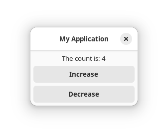
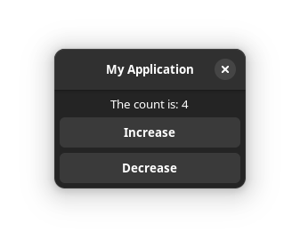

<!--
	SPDX-FileCopyrightText: 2023 Eduardo Javier Alvarado Aarón <eduardo.javier.alvarado.aaron@gmail.com>
	
	SPDX-License-Identifier: CC-BY-SA-4.0
-->

#  `declarative`

A proc-macro library for creating complex reactive views declaratively and quickly.

To use it, add to your Cargo.toml:

~~~ toml
[dependencies.declarative]
version = '0.2'

# for a custom builder mode:
features = ['builder-mode']

# if you're going to use it with gtk-rs, you might want to:
features = ['gtk-rs'] # gives a suitable `builder_mode!` macro
~~~

To learn how to use this macro, it is best to clone this repository, read the source code of the examples in alphabetical order and run them like this:

~~~ bash
cargo run --features gtk-rs --example EXAMPLE_NAME
~~~

The examples depend on [gtk-rs], so you should familiarize yourself with [gtk-rs] a bit before:  
https://gtk-rs.org/gtk4-rs/stable/latest/book/

[gtk-rs]: https://gtk-rs.org

You may need to tell rust-analyzer that the examples depend on the `gtk-rs` feature to avoid false positives.
For example, with VS Code it is configured with the following JSON:

~~~ JSON
{ "rust-analyzer.cargo.features": ["gtk-rs"] }
~~~

## Application example

In the following I manually implement the Elm pattern. The macro does not require any specific pattern.

~~~ rust
use declarative::{builder_mode, clone};
use gtk::{glib, prelude::*};

#[derive(Debug)]
enum Msg { Increase, Decrease }

struct State { count: i32 }

fn update_state(state: &mut State, msg: Msg) {
	match msg {
		Msg::Increase => state.count = state.count.wrapping_add(1),
		Msg::Decrease => state.count = state.count.wrapping_sub(1),
	}
}

#[declarative::view {
	gtk::ApplicationWindow window !{
		application: app
		title: "My Application"
		
		gtk::HeaderBar #titlebar(&#) { }
		
		gtk::Box #child(&#) !{
			orientation: gtk::Orientation::Vertical
			spacing: 6
			margin_top: 6
			margin_bottom: 6
			margin_start: 6
			margin_end: 6 #:
			
			gtk::Label #append(&#) {
				'bind! set_label: &format!("The count is: {}", state.count)
			}
			
			gtk::Button::with_label("Increase") #append(&#) {
				connect_clicked: clone! {
					sender; move |_| send!(Msg::Increase => sender)
				}
			}
			
			gtk::Button::with_label("Decrease") #append(&#) {
				connect_clicked: move |_| send!(Msg::Decrease => sender)
			}
			
			'binding update_view = move |state: &State| bindings!()
		}
	}
}]

fn window(app: &gtk::Application) -> gtk::ApplicationWindow {
	let mut state = State { count: 0 };
	let (sender, receiver) = glib::MainContext::channel(glib::PRIORITY_DEFAULT);
	
	expand_view_here! { }
	
	receiver.attach(None, move |msg| {
		update_state(&mut state, msg);
		update_view(&state);
		glib::Continue(true)
	});
	
	window
}

fn main() -> glib::ExitCode {
	let app = gtk::Application::default();
	app.connect_activate(move |app| window(app).present());
	app.run()
}

macro_rules! send {
	($expr:expr => $sender:ident) => {
		$sender.send($expr).unwrap_or_else(
			move |error| glib::g_critical!("example", "{error}")
		)
	};
}

use send;
~~~

To execute, run:

~~~ bash
cargo run --features gtk-rs --example y_readme
~~~

## License

Licensed under either of

* Apache License, Version 2.0 ([Apache-2.0.txt](LICENSES/Apache-2.0.txt) or http://www.apache.org/licenses/LICENSE-2.0)
* MIT license ([MIT.txt](LICENSES/MIT.txt) or http://opensource.org/licenses/MIT)

at your option.

## Contribution

Unless you explicitly state otherwise, any contribution intentionally submitted
for inclusion in the work by you, as defined in the Apache-2.0 license, shall be
dual licensed as above, without any additional terms or conditions.
