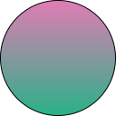

<!--
	SPDX-FileCopyrightText: 2025 Eduardo Javier Alvarado Aarón <eduardo.javier.alvarado.aaron@gmail.com>
	
	SPDX-License-Identifier: CC-BY-SA-4.0
-->

#  `declarative-macros`

[![REUSE status]][reuse] [![On crates.io]][crate.io]

[REUSE status]: https://api.reuse.software/badge/github.com/ejaa3/declarative
[reuse]: https://api.reuse.software/info/github.com/ejaa3/declarative
[On crates.io]: https://img.shields.io/crates/v/declarative-macros.svg?color=6081D4
[crate.io]: https://crates.io/crates/declarative-macros

A proc-macro library that implements a generic [DSL] to create complex reactive view code easier to edit and maintain.

[DSL]: https://en.wikipedia.org/wiki/Domain-specific_language

To use it, add to your Cargo.toml:

~~~ toml
[dependencies.declarative]
package = 'declarative-macros'
version = '0.7.1'
~~~

## Main crate

* https://crates.io/crates/declarative
* https://lib.rs/crates/declarative

 

#### License

Licensed under either of Apache License, Version 2.0 (<a href="../LICENSES/Apache-2.0.txt">Apache-2.0.txt</a> or http://www.apache.org/licenses/LICENSE-2.0) or MIT license (<a href="../LICENSES/MIT.txt">MIT.txt</a> or http://opensource.org/licenses/MIT) at your option.

Unless you explicitly state otherwise, any contribution intentionally submitted for inclusion in the work by you, as defined in the Apache-2.0 license, shall be dual licensed as above, without any additional terms or conditions.
